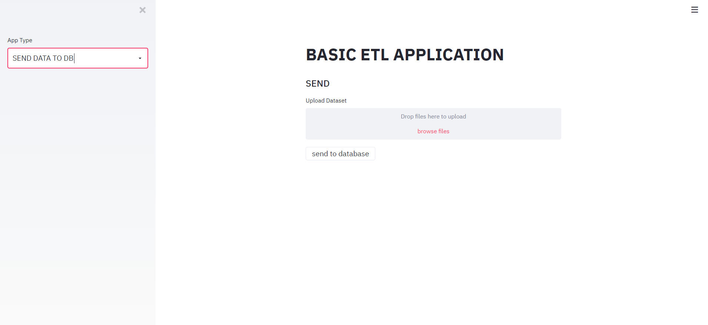
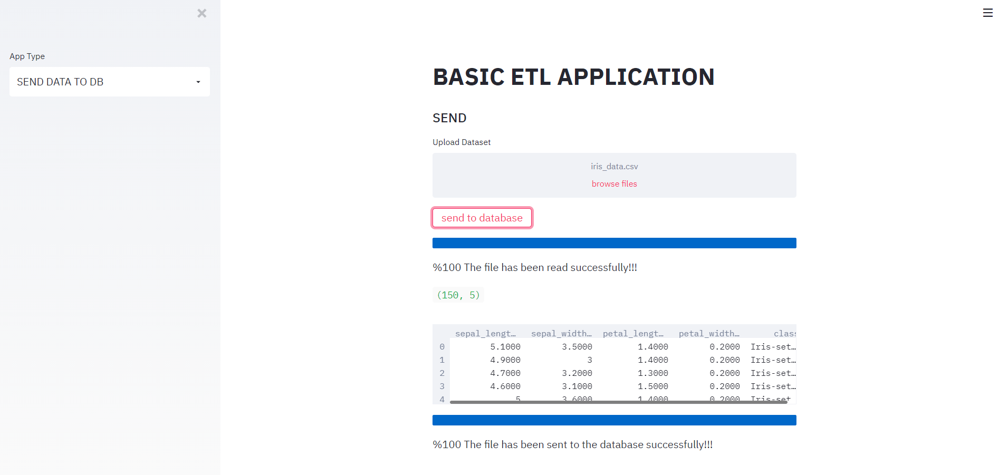
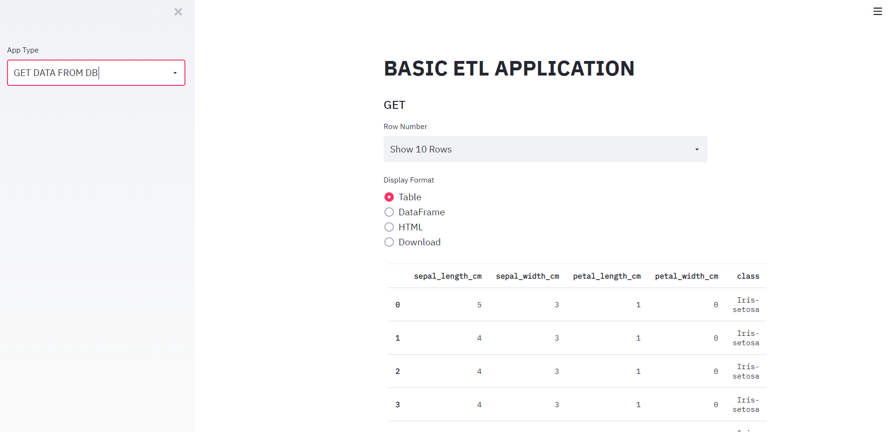
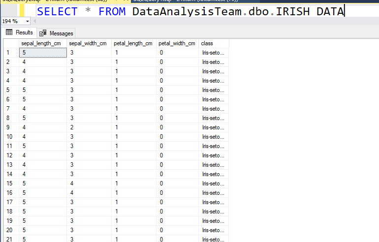
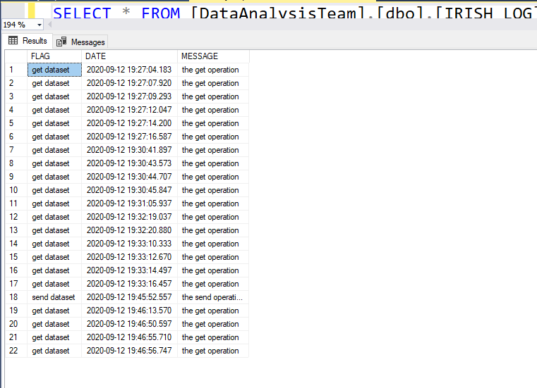

# Basic_ETL_App_with_Python_Streamlit  
Basic ETL App with Python Streamlit  
  
Instructions  
  
1-pip install pandas  
2-pip install streamlit  
3-Open Anaconda Navigator and Launch VSCode (or different IDE / whatever you want)  
4-On the VSCode --> Open Project Folder --> Select Basic_ETL project folder  
5-Open basic_etl_app.py file and write "streamlit run basic_etl_app.py" at the Terminal  
6-Here you go, now you should see running application on the your browser  
7-Try send and get operation and please check database data/log tables after each step  
  
  
Please do not hesitate to contact me, if there are any problems or you should need any further information.  
mmahmutcolak@gmail.com  
  
Thanks  

